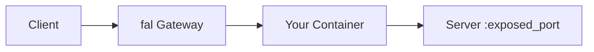
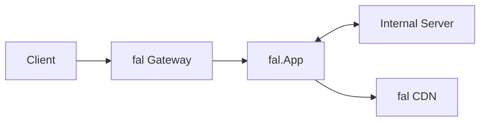

> ## Documentation Index
> Fetch the complete documentation index at: https://fal.ai/docs/llms.txt
> Use this file to discover all available pages before exploring further.

# Migrate an External Docker Server

> Deploy an existing Docker-based server (ComfyUI, custom APIs) to fal's serverless platform.

If you already have a working Docker container that runs a server, you can deploy it on fal with minimal changes. This guide covers two approaches: exposing your server's port directly for zero-code migration, or wrapping it with a `fal.App` proxy for full control over the API surface. Both approaches give you autoscaling, [analytics](/documentation/serverless/observability/app-analytics), and the same infrastructure that powers every model in the marketplace.

This is the fastest path for teams migrating from self-hosted infrastructure, Kubernetes, or other serverless platforms. Your existing server code stays unchanged. You just need to define a [Dockerfile](/documentation/development/use-custom-container-image) (or reference an existing image from a [private registry](/documentation/development/private-registries)) and tell fal how to start your server. If you are starting from scratch rather than migrating, the [Quick Start](/documentation/development/getting-started/quick-start) is a better starting point.

## fal.function vs fal.App

Most of the Serverless documentation focuses on `fal.App`, the class-based approach where you define `setup()`, endpoints, and `teardown()` as methods on a class. For server migration, this guide uses `@fal.function` instead. It is a decorator-based alternative that wraps a single function rather than a class. You pass all configuration (machine type, scaling parameters, container image) as decorator arguments, and the function body runs on the remote machine.

`fal.function` is the natural fit for existing servers because you typically just need to start a process and expose a port. You do not need lifecycle hooks or multiple endpoints since your server already handles those. Both `fal.function` and `fal.App` support the same scaling parameters (`keep_alive`, `min_concurrency`, `max_concurrency`, and more). See the [full parameter reference](#fal-function-reference) below for the complete list.

## Option 1: Direct Server Mode

Use `exposed_port` to route requests directly to your container's port. fal forwards all incoming traffic to that port without any intermediate processing. The port can be any valid port number, just ensure it matches the port your server listens on.



```python theme={null}
import subprocess
import fal
from fal.container import ContainerImage

DOCKERFILE = """
FROM your-base-image
# ... your setup
"""

@fal.function(
    image=ContainerImage.from_dockerfile_str(DOCKERFILE),
    machine_type="GPU-A100",
    exposed_port=8000,
    keep_alive=300,
)
def run_server():
    subprocess.run(
        ["your-server", "--host", "0.0.0.0", "--port", "8000"],
        check=True,
    )
```

Your server's API is exposed as-is. Requests go directly to the exposed port, and your existing routes, middleware, and response formats all work without modification.

<Warning>
  To unlock the full fal dashboard experience, including the [Playground](/documentation/model-apis/playground), analytics, and error tracking, fal needs your OpenAPI specification. For `fal.function` with `exposed_port`, pass the spec via the `metadata` parameter. For `fal.App`, the framework generates the OpenAPI spec automatically from your Pydantic models.

  Without an OpenAPI spec, the Playground and endpoint listing will not be available for your deployment. See [Providing an OpenAPI Spec via Metadata](#providing-an-openapi-spec-via-metadata) for a working example.
</Warning>

***

## Option 2: Proxy App Mode

Use `fal.App` to wrap your server with custom endpoints. This gives you control over the API surface: you can validate inputs with Pydantic, transform outputs, upload files to the [fal CDN](/documentation/model-apis/fal-cdn), and define a typed schema that powers the Playground UI.



```python theme={null}
import subprocess
import time
import fal
import requests
from fal.container import ContainerImage
from fal.toolkit import Image
from fastapi import Request
from pydantic import BaseModel, Field

DOCKERFILE = """
FROM your-base-image
# ... your setup
"""

SERVER_PORT = 8000

class GenerateRequest(BaseModel):
    prompt: str = Field(description="Text prompt")

class GenerateResponse(BaseModel):
    image: Image

class MyServerProxy(fal.App, keep_alive=300, max_concurrency=1):
    machine_type = "GPU-A100"
    image = ContainerImage.from_dockerfile_str(DOCKERFILE)

    def setup(self):
        self.process = subprocess.Popen(
            ["your-server", "--host", "127.0.0.1", "--port", str(SERVER_PORT)],
        )
        self._wait_for_server()

    def _wait_for_server(self, timeout=120):
        start = time.time()
        while time.time() - start < timeout:
            try:
                if requests.get(f"http://127.0.0.1:{SERVER_PORT}/", timeout=5).ok:
                    return
            except requests.ConnectionError:
                pass
            time.sleep(1)
        raise TimeoutError("Server did not start")

    @fal.endpoint("/generate")
    def generate(self, input: GenerateRequest, request: Request) -> GenerateResponse:
        resp = requests.post(
            f"http://127.0.0.1:{SERVER_PORT}/api/generate",
            json={"prompt": input.prompt},
            timeout=300,
        )
        resp.raise_for_status()

        image = Image.from_path(resp.json()["path"], request=request)
        return GenerateResponse(image=image)
```

Your `fal.App` controls the API. The internal server runs on localhost inside the same container, and your proxy endpoints handle input validation, output processing, and CDN uploads. This approach is ideal when you want a clean typed API over an existing server that has its own internal protocol.

## Using an External Registry

If your image is already hosted on an external registry (Docker Hub, Google Artifact Registry, Amazon ECR), you can pull it directly instead of building from a Dockerfile string. This avoids rebuilding the image on every deploy and is the recommended approach for production containers that are already built in CI. See [Using Private Docker Registries](/documentation/development/use-custom-container-image#using-private-docker-registries) for setup instructions including authentication for each registry type.

## fal.function Reference

The `@fal.function` decorator used in Option 1 accepts all the same infrastructure and scaling parameters that `fal.App` supports as class attributes. If you have been using `fal.function` and did not realize you could configure scaling, this table covers every available parameter.

| Parameter                 | Type                 | Default      | Description                                                                                                                                                |
| ------------------------- | -------------------- | ------------ | ---------------------------------------------------------------------------------------------------------------------------------------------------------- |
| `image`                   | `ContainerImage`     | None         | Custom Docker container for the function                                                                                                                   |
| `machine_type`            | `str` or `list[str]` | `"XS"` (CPU) | Hardware to run on. Use a list for fallback types.                                                                                                         |
| `num_gpus`                | `int`                | None         | Number of GPUs to allocate                                                                                                                                 |
| `exposed_port`            | `int`                | None         | Route traffic directly to this port (for existing servers)                                                                                                 |
| `requirements`            | `list[str]`          | None         | Pip packages to install (when not using `image`)                                                                                                           |
| `keep_alive`              | `int`                | 10           | Seconds an idle runner stays alive before shutting down                                                                                                    |
| `min_concurrency`         | `int`                | 0            | Minimum runners kept warm at all times                                                                                                                     |
| `max_concurrency`         | `int`                | None         | Maximum runners to scale up to                                                                                                                             |
| `max_multiplexing`        | `int`                | 1            | Maximum concurrent requests per runner                                                                                                                     |
| `concurrency_buffer`      | `int`                | 0            | Extra runners to keep warm above current load                                                                                                              |
| `concurrency_buffer_perc` | `int`                | 0            | Percentage buffer of runners above current load                                                                                                            |
| `scaling_delay`           | `int`                | None         | Seconds to wait before scaling up for a new request                                                                                                        |
| `request_timeout`         | `int`                | None         | Maximum seconds for a single request                                                                                                                       |
| `startup_timeout`         | `int`                | None         | Maximum seconds for the function to start                                                                                                                  |
| `setup_function`          | `Callable`           | None         | One-time initialization function (runs before first request)                                                                                               |
| `regions`                 | `list[str]`          | None         | Restrict to specific regions                                                                                                                               |
| `serve`                   | `bool`               | False        | Run as an HTTP server on port 8080                                                                                                                         |
| `metadata`                | `dict`               | None         | App metadata. Pass `{"openapi": {...}}` to provide your OpenAPI spec for Playground and endpoint listing. Required for `fal.function` with `exposed_port`. |
| `local_python_modules`    | `list[str]`          | None         | Local Python modules to ship to the remote environment. See [Import Code](/documentation/development/import-code).                                         |
| `python_version`          | `str`                | None         | Python version to use (for virtualenv kind).                                                                                                               |

A realistic example using scaling parameters:

```python theme={null}
@fal.function(
    image=ContainerImage.from_dockerfile_str(DOCKERFILE),
    machine_type="GPU-A100",
    exposed_port=8000,
    keep_alive=300,
    min_concurrency=1,
    max_concurrency=5,
    max_multiplexing=1,
    request_timeout=600,
    startup_timeout=300,
)
def run_server():
    subprocess.run(
        ["uvicorn", "main:app", "--host", "0.0.0.0", "--port", "8000"],
        check=True,
    )
```

For full documentation on `fal.App` configuration, see [App Lifecycle](/documentation/development/app-lifecycle). For scaling parameter details, see [Scale Your Application](/documentation/deployment/scale-your-application).

## Providing an OpenAPI Spec via Metadata

When using `fal.function` with `exposed_port`, fal does not automatically generate an OpenAPI spec from your code (unlike `fal.App` which derives it from your Pydantic models). To enable the Playground, endpoint listing, and schema validation in the dashboard, pass your OpenAPI spec through the `metadata` parameter.

```python theme={null}
@fal.function(
    image=ContainerImage.from_dockerfile_str(DOCKERFILE),
    machine_type="S",
    exposed_port=8080,
    metadata={
        "openapi": {
            "openapi": "3.0.3",
            "info": {"title": "My Server", "version": "1.0.0"},
            "paths": {
                "/generate": {
                    "post": {
                        "summary": "Generate",
                        "operationId": "generate",
                        "requestBody": {
                            "required": True,
                            "content": {
                                "application/json": {
                                    "schema": {
                                        "$ref": "#/components/schemas/GenerateRequest"
                                    }
                                }
                            },
                        },
                        "responses": {
                            "200": {
                                "description": "Success",
                                "content": {
                                    "application/json": {
                                        "schema": {
                                            "$ref": "#/components/schemas/GenerateResponse"
                                        }
                                    }
                                },
                            }
                        },
                    }
                }
            },
            "components": {
                "schemas": {
                    "GenerateRequest": {
                        "type": "object",
                        "required": ["prompt"],
                        "properties": {
                            "prompt": {"type": "string"},
                        },
                    },
                    "GenerateResponse": {
                        "type": "object",
                        "properties": {
                            "result": {"type": "string"},
                        },
                    },
                }
            },
        }
    },
)
def run_server():
    import uvicorn
    from fastapi import FastAPI
    from pydantic import BaseModel

    app = FastAPI()

    class GenerateRequest(BaseModel):
        prompt: str

    class GenerateResponse(BaseModel):
        result: str

    @app.post("/generate")
    async def generate(req: GenerateRequest) -> GenerateResponse:
        return GenerateResponse(result=f"Output for: {req.prompt}")

    uvicorn.run(app, host="0.0.0.0", port=8080)
```

<Note>
  Even if your server is built with FastAPI (which exposes `/openapi.json` automatically), the `metadata` approach is still required for `fal.function` deployments. The platform reads the spec from `metadata` at registration time, not from the running server.
</Note>

## Best Practices

Download model weights to [persistent storage](/documentation/development/use-persistent-storage) (`/data`) in your `setup()` method rather than baking them into the Docker image. This keeps your image small, speeds up container pulls, and allows weights to be cached across runner restarts. The `/data` directory is shared across all runners in your account and persists between deploys.

When building your Dockerfile, install fal-specific packages (`boto3`, `protobuf`, `pydantic`) at the end to avoid version conflicts with your existing dependencies. If your base image already includes these packages, the fal runtime will use the versions in your image.

Tune [keep\_alive](/documentation/deployment/scale-your-application) based on your app's cold start time and traffic pattern. If your model takes minutes to load, a longer keep\_alive avoids paying that cost repeatedly. If your app starts quickly, a shorter value reduces idle billing. See [Optimizing Costs](/documentation/serverless/optimizations/optimizing-costs) for guidance.

## Next Steps

For a complete tutorial that applies this pattern to a real server, see the [ComfyUI deployment example](/examples/image-generation/deploy-comfyui-server). For detailed Dockerfile configuration including build args, multi-stage builds, and private registries, see [Custom Container Images](/documentation/development/use-custom-container-image). To understand how the `/data` persistent storage works and what gets cached, see [Use Persistent Storage](/documentation/development/use-persistent-storage).
