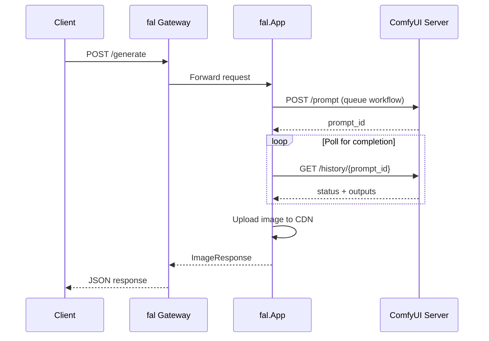

> ## Documentation Index
> Fetch the complete documentation index at: https://fal.ai/docs/llms.txt
> Use this file to discover all available pages before exploring further.

# Deploy a ComfyUI SDXL Turbo App

> Build a serverless image generation API using ComfyUI and SDXL Turbo on fal.

This tutorial shows how to deploy [ComfyUI](https://github.com/comfyanonymous/ComfyUI) with SDXL Turbo on fal. We'll create a proxy app that wraps ComfyUI with a clean REST API, complete with Pydantic validation and automatic CDN uploads.

SDXL Turbo generates high-quality images in just 1-4 inference steps, making it ideal for fast serverless inference.

## 🚀 Try this Example

**Steps to run:**

1. Install fal:

```bash theme={null}
pip install fal
```

2. Authenticate:

```bash theme={null}
fal auth login
```

3. Create the workflow file `sdxl_turbo_workflow.json`:

```json theme={null}
{
  "5": {
    "inputs": {"width": 512, "height": 512, "batch_size": 1},
    "class_type": "EmptyLatentImage",
    "_meta": {"title": "Empty Latent Image"}
  },
  "6": {
    "inputs": {"text": "beautiful landscape", "clip": ["20", 1]},
    "class_type": "CLIPTextEncode",
    "_meta": {"title": "CLIP Text Encode (Positive)"}
  },
  "7": {
    "inputs": {"text": "text, watermark", "clip": ["20", 1]},
    "class_type": "CLIPTextEncode",
    "_meta": {"title": "CLIP Text Encode (Negative)"}
  },
  "8": {
    "inputs": {"samples": ["13", 0], "vae": ["20", 2]},
    "class_type": "VAEDecode",
    "_meta": {"title": "VAE Decode"}
  },
  "13": {
    "inputs": {
      "add_noise": true,
      "noise_seed": 0,
      "cfg": 1,
      "model": ["20", 0],
      "positive": ["6", 0],
      "negative": ["7", 0],
      "sampler": ["14", 0],
      "sigmas": ["22", 0],
      "latent_image": ["5", 0]
    },
    "class_type": "SamplerCustom",
    "_meta": {"title": "SamplerCustom"}
  },
  "14": {
    "inputs": {"sampler_name": "euler_ancestral"},
    "class_type": "KSamplerSelect",
    "_meta": {"title": "KSamplerSelect"}
  },
  "20": {
    "inputs": {"ckpt_name": "sd_xl_turbo_1.0_fp16.safetensors"},
    "class_type": "CheckpointLoaderSimple",
    "_meta": {"title": "Load Checkpoint"}
  },
  "22": {
    "inputs": {"steps": 1, "denoise": 1, "model": ["20", 0]},
    "class_type": "SDTurboScheduler",
    "_meta": {"title": "SDTurboScheduler"}
  },
  "27": {
    "inputs": {"filename_prefix": "ComfyUI", "images": ["8", 0]},
    "class_type": "SaveImage",
    "_meta": {"title": "Save Image"}
  }
}
```

4. Copy the code below into `comfyui_sdxl_turbo.py`:

```python theme={null}
import json
import random
import subprocess
import time
from copy import deepcopy
from pathlib import Path

import fal
import requests
from fal.container import ContainerImage
from fal.toolkit import File, Image, download_model_weights
from fastapi import Request
from pydantic import BaseModel, Field


# =============================================================================
# UPLOAD WORKFLOW TO FAL CDN (happens at module load time)
# =============================================================================

WORKFLOW_PATH = Path(__file__).parent / "sdxl_turbo_workflow.json"
WORKFLOW_URL = File.from_path(str(WORKFLOW_PATH), repository="cdn").url


# =============================================================================
# PYDANTIC MODELS
# =============================================================================

class ImageRequest(BaseModel):
    prompt: str = Field(
        description="The text prompt describing the image to generate.",
        examples=["beautiful landscape scenery glass bottle with a galaxy inside"],
    )
    negative_prompt: str = Field(
        default="text, watermark, blurry, low quality",
        description="Negative prompt to guide what to avoid in generation.",
    )
    width: int = Field(default=512, ge=256, le=1024)
    height: int = Field(default=512, ge=256, le=1024)
    num_inference_steps: int = Field(default=1, ge=1, le=4)
    seed: int = Field(default_factory=lambda: random.randint(0, 2**31 - 1))


class ImageResponse(BaseModel):
    image: Image = Field(description="The generated image.")
    seed: int = Field(description="The seed used for generation.")


# =============================================================================
# DOCKERFILE - Uses ADD to download workflow.json from fal CDN during build
# =============================================================================

DOCKERFILE_STR = f"""
FROM falai/base:3.11-12.1.0

USER root

RUN apt-get update && apt-get install -y --no-install-recommends \\
    git wget libgl1-mesa-glx libglib2.0-0 && rm -rf /var/lib/apt/lists/*

RUN git clone https://github.com/comfyanonymous/ComfyUI /app/ComfyUI
WORKDIR /app/ComfyUI
RUN pip install --no-cache-dir -r requirements.txt
RUN mkdir -p models/checkpoints

# Download workflow from fal CDN
ADD {WORKFLOW_URL} /app/workflow.json

# Install fal packages LAST
RUN pip install --no-cache-dir boto3==1.35.74 protobuf==4.25.1 pydantic==2.10.6
"""


# =============================================================================
# MODEL CONFIGURATION - Downloaded to /data at runtime
# =============================================================================

MODELS = {
    "checkpoints/sd_xl_turbo_1.0_fp16.safetensors": 
        "https://huggingface.co/stabilityai/sdxl-turbo/resolve/main/sd_xl_turbo_1.0_fp16.safetensors",
}


# =============================================================================
# FAL APP
# =============================================================================

class ComfyUISDXLTurbo(fal.App, keep_alive=300, max_concurrency=1):
    machine_type = "GPU-A100"
    image = ContainerImage.from_dockerfile_str(DOCKERFILE_STR)
    
    COMFYUI_HOST = "127.0.0.1"
    COMFYUI_PORT = 8188
    COMFYUI_DIR = Path("/app/ComfyUI")
    
    def setup(self):
        self.process = None
        self.workflow_template = None
        
        # Download models to persistent /data storage
        self._download_models()
        self._link_models()
        
        # Start ComfyUI server in background (non-blocking)
        self.process = subprocess.Popen(
            ["python", "main.py", "--listen", self.COMFYUI_HOST, "--port", str(self.COMFYUI_PORT)],
            cwd=str(self.COMFYUI_DIR),
            stdout=subprocess.PIPE,
            stderr=subprocess.STDOUT,
        )
        self._wait_for_server(timeout=120)
        
        # Load workflow template
        with open("/app/workflow.json", encoding="utf-8") as f:
            self.workflow_template = json.load(f)
    
    def _download_models(self):
        """Download models using fal toolkit (handles atomic writes automatically)."""
        self._downloaded_paths = {}
        for model_path, url in MODELS.items():
            # download_model_weights handles caching and atomic writes
            downloaded_path = download_model_weights(url)
            self._downloaded_paths[model_path] = downloaded_path
    
    def _link_models(self):
        """Symlink models from downloaded paths to ComfyUI's models directory."""
        for model_path in MODELS:
            downloaded_path = self._downloaded_paths[model_path]
            comfy_path = self.COMFYUI_DIR / "models" / model_path
            comfy_path.parent.mkdir(parents=True, exist_ok=True)
            if comfy_path.exists() or comfy_path.is_symlink():
                comfy_path.unlink()
            comfy_path.symlink_to(downloaded_path)
    
    def _wait_for_server(self, timeout: int = 120):
        start = time.time()
        while time.time() - start < timeout:
            try:
                resp = requests.get(f"http://{self.COMFYUI_HOST}:{self.COMFYUI_PORT}/system_stats", timeout=5)
                if resp.status_code == 200:
                    return
            except requests.ConnectionError:
                pass
            time.sleep(1)
        raise TimeoutError("ComfyUI server did not start")
    
    def _build_workflow(self, request: ImageRequest) -> dict:
        workflow = deepcopy(self.workflow_template)
        workflow["6"]["inputs"]["text"] = request.prompt
        workflow["7"]["inputs"]["text"] = request.negative_prompt
        workflow["5"]["inputs"]["width"] = request.width
        workflow["5"]["inputs"]["height"] = request.height
        workflow["13"]["inputs"]["noise_seed"] = request.seed
        workflow["22"]["inputs"]["steps"] = request.num_inference_steps
        return workflow
    
    def _queue_prompt(self, prompt: dict) -> str:
        resp = requests.post(
            f"http://{self.COMFYUI_HOST}:{self.COMFYUI_PORT}/prompt",
            json={"prompt": prompt},
            timeout=30,
        )
        resp.raise_for_status()
        return resp.json()["prompt_id"]
    
    def _poll_for_completion(self, prompt_id: str, timeout: int = 120) -> dict:
        start = time.time()
        while time.time() - start < timeout:
            resp = requests.get(
                f"http://{self.COMFYUI_HOST}:{self.COMFYUI_PORT}/history/{prompt_id}",
                timeout=30,
            )
            resp.raise_for_status()
            history = resp.json()
            if prompt_id in history:
                prompt_history = history[prompt_id]
                if prompt_history.get("status", {}).get("completed", False):
                    return prompt_history
            time.sleep(0.5)
        raise TimeoutError("Generation did not complete")
    
    def _get_output_image(self, history: dict) -> str | None:
        for node_output in history.get("outputs", {}).values():
            if "images" in node_output and node_output["images"]:
                filename = node_output["images"][0].get("filename")
                subfolder = node_output["images"][0].get("subfolder", "")
                if filename:
                    if subfolder:
                        return f"{self.COMFYUI_DIR}/output/{subfolder}/{filename}"
                    return f"{self.COMFYUI_DIR}/output/{filename}"
        return None
    
    @fal.endpoint("/generate")
    def generate_image(self, input: ImageRequest, request: Request) -> ImageResponse:
        workflow = self._build_workflow(input)
        prompt_id = self._queue_prompt(workflow)
        history = self._poll_for_completion(prompt_id)
        
        image_path = self._get_output_image(history)
        if not image_path:
            raise RuntimeError("No image output found")
        
        image = Image.from_path(image_path, request=request)
        return ImageResponse(image=image, seed=input.seed)
```

5. Run the app:

```bash theme={null}
fal run comfyui_sdxl_turbo.py
```

<Tip>
  **Before you run**, make sure you have:

  * Authenticated with fal: `fal auth login`
  * Created the `sdxl_turbo_workflow.json` file in the same directory
</Tip>

## Architecture Overview

The app runs ComfyUI as a background process and communicates with it via HTTP:



## Key Concepts

### Including the Workflow File

Container apps don't support `COPY` instructions or `app_files` for including local files. Instead, we upload the workflow to fal's CDN and use `ADD` in the Dockerfile:

```python theme={null}
from fal.toolkit import File

WORKFLOW_PATH = Path(__file__).parent / "sdxl_turbo_workflow.json"
WORKFLOW_URL = File.from_path(str(WORKFLOW_PATH), repository="cdn").url

DOCKERFILE_STR = f"""
...
ADD {WORKFLOW_URL} /app/workflow.json
...
"""
```

See [Use Custom Container Images](/serverless/development/use-custom-container-image) for more details.

### Runtime Model Loading

Large model weights are downloaded to `/data` (persistent storage) at runtime using `download_model_weights` from fal's toolkit:

```python theme={null}
from fal.toolkit import download_model_weights

def _download_models(self):
    self._downloaded_paths = {}
    for model_path, url in MODELS.items():
        # download_model_weights handles caching and atomic writes
        downloaded_path = download_model_weights(url)
        self._downloaded_paths[model_path] = downloaded_path
```

The `download_model_weights` function:

* **Atomic writes**: Downloads to a temp file first, then renames (prevents corrupted files if multiple workers start simultaneously)
* **Automatic caching**: Skips download if the file already exists
* **Smart storage**: Saves to `/data/.fal/model_weights/{hash}/{filename}`

<Tip>
  **Why not bake models into Docker?**

  * Docker images must be pulled on cold starts - larger images = slower cold starts
  * `/data` is a distributed filesystem - once downloaded, models are available to all workers
</Tip>

### Symlinking Models

ComfyUI expects models in specific directories. We create symlinks from ComfyUI's model directories to the downloaded paths:

```python theme={null}
def _link_models(self):
    for model_path in MODELS:
        downloaded_path = self._downloaded_paths[model_path]
        comfy_path = self.COMFYUI_DIR / "models" / model_path
        comfy_path.parent.mkdir(parents=True, exist_ok=True)
        if comfy_path.exists() or comfy_path.is_symlink():
            comfy_path.unlink()
        comfy_path.symlink_to(downloaded_path)
```

### Background Server with Popen

ComfyUI runs as a non-blocking background process using `subprocess.Popen`. Unlike `subprocess.run()` which blocks until completion, `Popen` starts the process and returns immediately, allowing your app to continue setup:

```python theme={null}
def setup(self):
    # Popen starts ComfyUI in the background (non-blocking)
    self.process = subprocess.Popen(
        ["python", "main.py", "--listen", "127.0.0.1", "--port", "8188"],
        cwd=str(self.COMFYUI_DIR),
        stdout=subprocess.PIPE,
    )
    
    # Wait for the server to be ready before accepting requests
    self._wait_for_server()
```

The server continues running for the lifetime of the worker, handling multiple requests.

### ComfyUI API Interaction

The app communicates with ComfyUI via its HTTP API:

1. **Queue prompt**: `POST /prompt` with the workflow JSON
2. **Poll for completion**: `GET /history/{prompt_id}` until `completed: true`
3. **Get outputs**: Extract file paths from the history response

```python theme={null}
def _queue_prompt(self, prompt: dict) -> str:
    resp = requests.post(f"http://127.0.0.1:8188/prompt", json={"prompt": prompt})
    return resp.json()["prompt_id"]
```

### Image Output with fal Toolkit

Use `Image.from_path()` to upload generated images to fal's CDN:

```python theme={null}
from fal.toolkit import Image

image = Image.from_path(image_path, request=request)
return ImageResponse(image=image, seed=input.seed)
```

The `request` parameter ensures proper metadata is attached for the fal playground.

## Customizing the Workflow

### Exporting from ComfyUI

1. Build your workflow in ComfyUI's web interface
2. Click **Save (API Format)** to export as JSON
3. Replace the contents of `sdxl_turbo_workflow.json`

### Mapping Node IDs

When you export a workflow, each node has an ID. Update `_build_workflow()` to map your inputs to the correct node IDs:

```python theme={null}
def _build_workflow(self, request: ImageRequest) -> dict:
    workflow = deepcopy(self.workflow_template)
    
    # Find the correct node IDs by inspecting your workflow JSON
    workflow["6"]["inputs"]["text"] = request.prompt      # CLIP Text Encode (Positive)
    workflow["7"]["inputs"]["text"] = request.negative_prompt  # CLIP Text Encode (Negative)
    workflow["5"]["inputs"]["width"] = request.width      # EmptyLatentImage
    # ... etc
    
    return workflow
```

## Best Practices

1. **Use `/data` for model weights**: Download large models to `/data` in `setup()` instead of baking them into the Docker image. This improves cold start times.

2. **Pin your dependencies**: Specify exact versions in the Dockerfile to ensure reproducible builds.

3. **Set appropriate timeouts**: Model loading and generation can take time. Use generous timeouts.

4. **Use `keep_alive`**: Set `keep_alive` to avoid cold starts between requests.

## Troubleshooting

### Model Not Found

Check that:

1. The model is downloaded to the correct path in `/data`
2. The symlink points to the correct file
3. The workflow uses the correct model filename

### Permission Errors in Dockerfile

The `falai/base` image runs as a non-root user. Add `USER root` before `apt-get`:

```dockerfile theme={null}
FROM falai/base:3.11-12.1.0
USER root
RUN apt-get update && apt-get install -y git wget
```

## Using an External Registry?

If you have a ComfyUI Docker image hosted on an external registry (Docker Hub, Google Artifact Registry, Amazon ECR), you can pull it directly instead of building from a Dockerfile. See [Using Private Docker Registries](/serverless/development/use-custom-container-image#using-private-docker-registries) for setup instructions.

## Next Steps

* [Migrate External Docker Servers](/serverless/migrations/migrate-external-docker-server) - Direct port exposure vs. proxy pattern
* [Use Custom Container Images](/serverless/development/use-custom-container-image) - Dockerfile patterns
* [Use Persistent Storage](/serverless/development/use-persistent-storage) - More about `/data` directory
* [Scale Your Application](/serverless/deployment-operations/scale-your-application) - Handle more traffic
