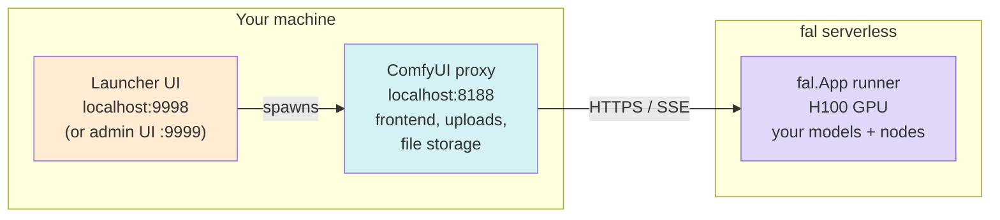

> ## Documentation Index
> Fetch the complete documentation index at: https://fal.ai/docs/llms.txt
> Use this file to discover all available pages before exploring further.

# Deploy ComfyUI on fal — Visual Control

> Edit ComfyUI workflows visually from your laptop with a fal-hosted GPU backend. Two zips, double-click, no code.

Run ComfyUI workflows on fal serverless GPUs while editing them visually from your local machine. Two pre-built packages handle setup so you don't need to write any code:

* **User package** — open the ComfyUI canvas and run workflows on a deployed fal endpoint.
* **Admin package** — add models, custom nodes, and Python deps in a small web UI, then deploy to fal in one click.

Pick the visual editor for prototyping and creative iteration. When you're ready to ship the workflow as an HTTP endpoint, jump to [Deploy a ComfyUI SDXL Turbo App](/examples/image-generation/deploy-comfyui-server) for the production code-first flow.

<Frame>
  
</Frame>

***

## How it works



The proxy implements ComfyUI's full API locally. Each prompt is streamed to a fal runner — progress, previews, and outputs come back in real time. Nothing about the canvas or upload flow leaves your machine until you queue a prompt.

***

## For users — open the canvas in three steps

<Steps>
  <Step title="Download">
    Get the [user package zip](https://v3b.fal.media/files/b/0a984481/qK6dLV7FWuaEdFa-GfeJ2_fal-comfyui.zip) from your team lead, or directly if they've shared the link with you. Unzip it anywhere.

    The unzipped folder contains a `README.md`, a launcher (`ComfyUI.command` on macOS, `ComfyUI.bat` on Windows), and an `app/` folder with the internals.
  </Step>

  <Step title="Double-click the launcher">
    * **macOS** — right-click `ComfyUI.command` → **Open** → **Open** in the Gatekeeper dialog (only on first launch).
    * **Windows** — double-click `ComfyUI.bat`. If SmartScreen pops up, choose **More info** → **Run anyway**. Requires [Python 3.11](https://www.python.org/downloads/) — check "Add Python to PATH" during install.

    First run installs everything automatically (a tool called `uv`, Python 3.11, the proxy dependencies). Takes 1–3 minutes. Subsequent launches are instant.
  </Step>

  <Step title="Paste your fal API key + endpoint">
    A browser tab opens on `http://localhost:9998`. Enter:

    * **fal API key** — from [fal.ai/dashboard/keys](https://fal.ai/dashboard/keys).
    * **Endpoint** — the slug your admin gave you, in the form `<team>/<app>` (e.g. `acme/comfy`).

    Click **Start ComfyUI**. A second tab opens on `http://localhost:8188` with the full ComfyUI canvas. Build, queue, and iterate as usual — every prompt runs on the fal GPU.
  </Step>
</Steps>

<Note>
  The first prompt of the day takes **5–10 minutes** to warm up — the runner downloads model weights and installs custom nodes. After that, prompts run in seconds while the runner stays warm. "Reconnecting" toasts that occasionally flash in ComfyUI are cosmetic.
</Note>

***

## For admins — configure and deploy

Team leads use the admin package to control which models, custom nodes, and Python packages live in the deployed runtime.

<Steps>
  <Step title="Download the admin package">
    Get the [admin package zip](https://v3b.fal.media/files/b/0a984481/gOJXw81mtatswV1BdCt3O_fal-comfyui-admin.zip) and unzip. Double-click `admin-ui.command` (macOS) or `admin-ui.bat` (Windows). The browser opens on `http://localhost:9999`.
  </Step>

  <Step title="Settings — credentials and tokens">
    Open the **Settings** tab and fill in:

    * **fal API key** — generate at [fal.ai/dashboard/keys](https://fal.ai/dashboard/keys) **after switching to the right team** in the dashboard. The team is encoded in the key, so creating it on the wrong team deploys to the wrong place.
    * **App name** — the slug for your deployment (e.g. `comfy`).
    * **HuggingFace token** *(optional)* — needed for gated models such as Flux 2 Klein. Saved to `.env` and pushed to fal as a runner secret automatically at deploy time.
    * **Civitai token** *(optional)* — same idea, for Civitai-hosted weights.

    The top-right header shows **Deploying as `<team>`** so you can verify the key targets the right account before pushing anything.
  </Step>

  <Step title="Edit Models, Custom Nodes, Python Deps">
    Three tabs in the admin UI mirror the structure of the deployed runtime:

    * **Models** — folder + filename + download URL. Sub-folders are supported (`klein/my-lora.safetensors` saves into `loras/klein/`).
    * **Custom Nodes** — paste a GitHub URL and pin a commit. The UI fetches the repo's `requirements.txt` so you can confirm extra Python deps before saving.
    * **Python Deps** — direct editor over `comfy_server/requirements.txt`.

    Add a fal-trained LoRA the same way: paste its `.safetensors` URL (e.g. `https://v3b.fal.media/...`) and set folder to `loras`.
  </Step>

  <Step title="Click Deploy">
    The **Deploy** button in the top bar runs `fal deploy` end-to-end and streams logs to the bottom drawer. Wait for `[DEPLOY SUCCESSFUL]`.

    Share the resulting `<team>/<app>` slug with your users along with the user zip from the section above.
  </Step>
</Steps>

### What the admin UI gives you on top of `fal deploy`

* **Live runner view** — chip in the header lists current GPU runners for your app, with one-click log streaming and termination. Pulsing green dot when at least one runner is `RUNNING`.
* **Outputs gallery** — every image and video produced by the proxy, with per-file download and a "Download all" zip. Filenames are auto-disambiguated when multiple workflows produce the same base name (`video.mp4` → `video_2.mp4` → …).
* **Run ComfyUI** — starts the bundled local proxy and opens the canvas pointing at your deployed app. The button shows the live runner state (`cold-starting`, `idle · ready`, `processing`).
* **Theme + ComfyUI commit pin** — dark/light toggle, plus a clickable chip to pin a specific upstream ComfyUI commit (validated against `comfyanonymous/ComfyUI`).
* **Undeploy** — confirmation-gated button under Settings → Danger zone if you ever want to retire an app.

***

## Multi-user concurrency

Each user runs the proxy locally, so there's no cross-machine state to worry about. fal itself routes incoming prompts to whichever runner is free, capped by your app's `max_concurrency`. Tune it once via the CLI:

```bash theme={null}
fal apps scale <app> --min-concurrency 1 --max-concurrency 5 --max-multiplexing 1
```

| Setting                | Effect                                                                |
| ---------------------- | --------------------------------------------------------------------- |
| `max_concurrency = 1`  | Only one runner ever — second user's prompt queues. Cheapest.         |
| `max_concurrency = N`  | Up to N runners in parallel. Each cold-starts the first time.         |
| `min_concurrency = 1`  | Keep one runner always warm — no cold-start for the first user.       |
| `max_multiplexing = 1` | One prompt per runner at a time. Recommended for GPU-heavy workflows. |

***

## When to use this vs. the SDXL deploy guide

| Scenario                                                  | Use this page | Use [Deploy SDXL Turbo](/examples/image-generation/deploy-comfyui-server) |
| --------------------------------------------------------- | ------------- | ------------------------------------------------------------------------- |
| Iterating on a workflow visually                          | ✅             |                                                                           |
| Sharing a creative tool with a non-technical team         | ✅             |                                                                           |
| Wrapping a fixed workflow as a REST API for production    |               | ✅                                                                         |
| Custom request/response schemas (Pydantic)                |               | ✅                                                                         |
| Fine control over `fal.App` lifecycle, secrets, multi-GPU |               | ✅                                                                         |

The visual editor is the right starting point. When the workflow is locked and you need a cleanly typed endpoint, the SDXL Turbo guide shows the code-first flow.

***

## Troubleshooting

| Issue                                                     | Fix                                                                                                                                                                  |
| --------------------------------------------------------- | -------------------------------------------------------------------------------------------------------------------------------------------------------------------- |
| macOS: "can't be opened, unidentified developer"          | Right-click `.command` → **Open** → **Open**.                                                                                                                        |
| Windows: SmartScreen blocks the `.bat`                    | **More info** → **Run anyway**.                                                                                                                                      |
| Launcher fails to install `uv`                            | Install it manually: `curl -LsSf https://astral.sh/uv/install.sh \| sh` (macOS) or `irm https://astral.sh/uv/install.ps1 \| iex` in PowerShell (Windows). Re-launch. |
| Deploy fails with `401 Unauthorized` on a HuggingFace URL | The model is gated. Set the **HuggingFace token** in admin Settings and re-deploy — the admin UI pushes it to fal secrets automatically.                             |
| Runner stuck in `SETUP` for several minutes               | Normal on first cold start while weights download (5–10 min).                                                                                                        |
| Two runners spawn for one user                            | Lower `max_concurrency`: `fal apps scale <app> --max-concurrency 1`.                                                                                                 |
| Port already in use on `:9999`, `:9998`, or `:8188`       | The launcher auto-kills stale instances on next start. If something else is binding the port, close it before relaunching.                                           |
| Stop everything                                           | Close the launcher terminal window. The proxy and admin UI shut down with it.                                                                                        |

***

## Uninstall

Delete the unzipped folder. Everything is self-contained — local Python venv, models cache, env file, logs. Nothing is installed globally.
