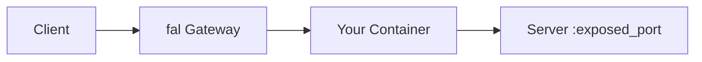
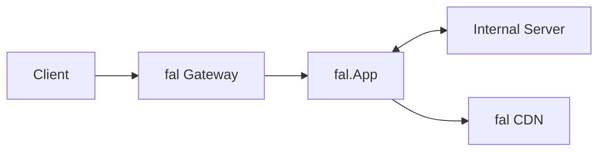

> ## Documentation Index
> Fetch the complete documentation index at: https://fal.ai/docs/llms.txt
> Use this file to discover all available pages before exploring further.

# Migrate an External Docker Server

> Deploy an existing Docker-based server (ComfyUI, custom APIs) to fal's serverless platform.

This guide shows how to migrate an existing Docker container that runs a server to fal. There are two approaches:

* **Direct Server Mode**: Expose your server's port directly
* **Proxy App Mode**: Wrap your server with a custom API layer

## Option 1: Direct Server Mode

Use `exposed_port` to route requests directly to your container's port. The port can be any valid port number — just ensure it matches the port your server listens on.



```python theme={null}
import subprocess
import fal
from fal.container import ContainerImage

DOCKERFILE = """
FROM your-base-image
# ... your setup
"""

@fal.function(
    image=ContainerImage.from_dockerfile_str(DOCKERFILE),
    machine_type="GPU-A100",
    exposed_port=8000,  # Must match your server's port
    keep_alive=300,
)
def run_server():
    subprocess.run(
        ["your-server", "--host", "0.0.0.0", "--port", "8000"],
        check=True,
    )
```

Your server's API is exposed as-is. Requests go directly to `exposed_port`.

<Warning>
  To unlock the full fal dashboard experience—including the playground, analytics, and error tracking—your server must expose an `/openapi.json` endpoint that returns your OpenAPI specification. Without this endpoint, these features will not be available for your deployment.
</Warning>

***

## Option 2: Proxy App Mode

Use `fal.App` to wrap your server with custom endpoints.



```python theme={null}
import subprocess
import time
import fal
import requests
from fal.container import ContainerImage
from fal.toolkit import Image
from fastapi import Request
from pydantic import BaseModel, Field

DOCKERFILE = """
FROM your-base-image
# ... your setup
"""

SERVER_PORT = 8000

class GenerateRequest(BaseModel):
    prompt: str = Field(description="Text prompt")
    
class GenerateResponse(BaseModel):
    image: Image


class MyServerProxy(fal.App, keep_alive=300, max_concurrency=1):
    machine_type = "GPU-A100"
    image = ContainerImage.from_dockerfile_str(DOCKERFILE)
    
    def setup(self):
        # Start server in background (non-blocking)
        self.process = subprocess.Popen(
            ["your-server", "--host", "127.0.0.1", "--port", str(SERVER_PORT)],
        )
        self._wait_for_server()
    
    def _wait_for_server(self, timeout=120):
        start = time.time()
        while time.time() - start < timeout:
            try:
                if requests.get(f"http://127.0.0.1:{SERVER_PORT}/", timeout=5).ok:
                    return
            except requests.ConnectionError:
                pass
            time.sleep(1)
        raise TimeoutError("Server did not start")
    
    @fal.endpoint("/generate")
    def generate(self, input: GenerateRequest, request: Request) -> GenerateResponse:
        # Call internal server
        resp = requests.post(
            f"http://127.0.0.1:{SERVER_PORT}/api/generate",
            json={"prompt": input.prompt},
            timeout=300,
        )
        resp.raise_for_status()
        
        # Upload to fal CDN
        image = Image.from_path(resp.json()["path"], request=request)
        return GenerateResponse(image=image)
```

Your `fal.App` controls the API. You can validate inputs, process outputs, and upload to CDN.

## Using an External Registry?

If your image is already hosted on an external registry (Docker Hub, Google Artifact Registry, Amazon ECR), you can pull it directly instead of building from a Dockerfile. See [Using Private Docker Registries](/serverless/development/use-custom-container-image#using-private-docker-registries) for setup instructions.

## Best Practices

1. **Use `/data` for model weights**: Download to persistent storage in `setup()`, not baked into Docker.

2. **Install fal packages last**: Add `boto3`, `protobuf`, `pydantic` at the end of Dockerfile to avoid conflicts.

3. **Set `keep_alive`**: Avoid cold starts between requests.

## Next Steps

* [Deploy a ComfyUI SDXL Turbo App](/serverless/tutorials/deploy-comfyui-server) - Complete tutorial
* [Use Custom Container Images](/serverless/development/use-custom-container-image) - Dockerfile patterns
* [Use Persistent Storage](/serverless/development/use-persistent-storage) - The `/data` directory
