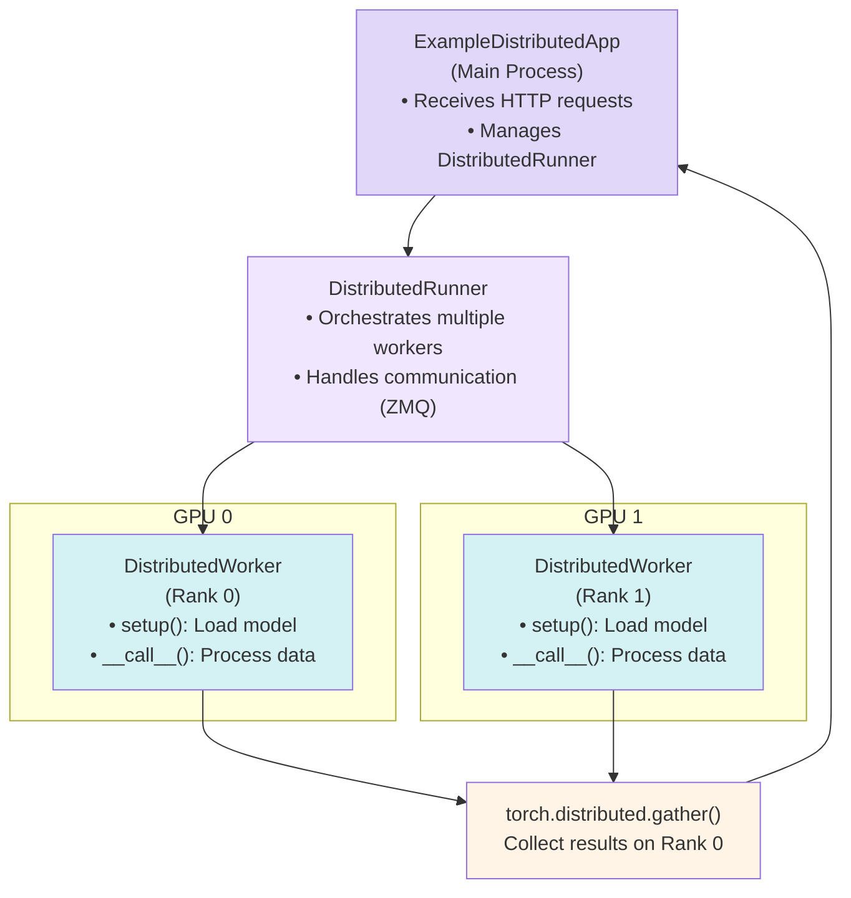

> ## Documentation Index
> Fetch the complete documentation index at: https://fal.ai/docs/llms.txt
> Use this file to discover all available pages before exploring further.

# Deploy Multi-GPU Inference

> Learn how to build a multi-GPU image generation service using data parallelism with Stable Diffusion XL, including real-time streaming and distributed worker coordination.

This tutorial demonstrates how to leverage multiple GPUs for parallel image generation using the `fal.distributed` module. We'll build a production-ready SDXL service that generates multiple image variations simultaneously and supports real-time streaming.

<Note>
  For a comprehensive overview of multi-GPU parallelism strategies and when to use them, see the [Multi-GPU Workloads Overview](/serverless/distributed/overview).
</Note>

## 🚀 Try this Example

View the complete source code on [GitHub](https://github.com/fal-ai-community/fal-demos/tree/main/fal_demos/distributed/inference/parallel_sdxl).

**Steps to run:**

1. Install fal:

```bash theme={null}
pip install fal
```

2. Authenticate (if not already done):

```bash theme={null}
fal auth login
```

3. Copy the code below into `parallel_sdxl.py`

<CodeGroup>
  ```python parallel_sdxl.py wrap theme={null}
  from math import floor, sqrt
  from typing import TYPE_CHECKING, Any

  import fal
  from fal.distributed import DistributedRunner, DistributedWorker
  from fal.toolkit import File, Image
  from fastapi.responses import Response, StreamingResponse
  from pydantic import BaseModel, Field

  if TYPE_CHECKING:
      import torch
      from PIL import Image as PILImage

  # Helper function


  def tensors_to_image_grid(
      tensors: list["torch.Tensor"], blur_radius: int = 0
  ) -> "PILImage.Image":
      """
      Convert a list of tensors to a grid image.
      """
      import torchvision  # type: ignore[import-untyped]
      from PIL import Image as PILImage
      from PIL import ImageFilter

      # Create a grid of images
      image = (
          torchvision.utils.make_grid(
              tensors,
              nrow=floor(sqrt(len(tensors))),
              normalize=True,
              scale_each=True,
          )
          .permute(1, 2, 0)
          .cpu()
          .numpy()
      )
      image = (image * 255).astype("uint8")
      pil_image = PILImage.fromarray(image)

      if blur_radius > 0:
          pil_image = pil_image.filter(ImageFilter.GaussianBlur(radius=blur_radius))

      return pil_image


  # Distributed app code


  class ExampleDistributedWorker(DistributedWorker):
      """
      This is a distributed worker that runs on multiple GPUs.

      It will run the Stable Diffusion XL model using random seeds on each GPU,
      then return the images as a grid to the main process.
      """

      def setup(self, **kwargs: Any) -> None:
          """
          On setup, we need to initialize the model.
          """
          import torch
          from diffusers import AutoencoderTiny, StableDiffusionXLPipeline

          self.pipeline = StableDiffusionXLPipeline.from_pretrained(
              "stabilityai/stable-diffusion-xl-base-1.0",
              low_cpu_mem_usage=False,
          ).to(self.device, dtype=torch.float16)
          self.tiny_vae = AutoencoderTiny.from_pretrained(
              "madebyollin/taesdxl",
              torch_dtype=torch.float16,
          ).to(self.device, dtype=torch.float16)
          if self.rank != 0:
              self.pipeline.set_progress_bar_config(disable=True)

      def pipeline_callback(
          self,
          pipeline: "torch.nn.Module",
          step: int,
          timestep: int,
          tensors: dict[str, "torch.Tensor"],
      ) -> dict[str, "torch.Tensor"]:
          """
          This callback is called after each step of the pipeline.
          """
          if step > 0 and step % 5 != 0:
              return tensors

          import torch
          import torch.distributed as dist

          latents = tensors["latents"]
          image = self.tiny_vae.decode(
              latents / self.tiny_vae.config.scaling_factor, return_dict=False
          )[0]
          image = self.pipeline.image_processor.postprocess(image, output_type="pt")[0]

          if self.rank == 0:
              gather_list = [
                  torch.zeros_like(image, device=self.device)
                  for _ in range(self.world_size)
              ]
          else:
              gather_list = None

          dist.gather(image, gather_list, dst=0)

          if gather_list:
              remaining = timestep / 1000
              image = tensors_to_image_grid(gather_list, blur_radius=int(remaining * 10))
              self.add_streaming_result({"image": image}, as_text_event=True)

          dist.barrier()
          return tensors

      def __call__(
          self,
          streaming: bool = False,
          width: int = 1024,
          height: int = 1024,
          prompt: str = "A fantasy landscape",
          negative_prompt: str = "A blurry image",
          num_inference_steps: int = 20,
          **kwargs: Any,
      ) -> dict[str, Any]:
          """
          Run the model on the worker and return the image.
          """
          import torch
          import torch.distributed as dist

          image = self.pipeline(
              prompt=prompt,
              height=height,
              width=width,
              negative_prompt=negative_prompt,
              num_inference_steps=num_inference_steps,
              output_type="pt",
              callback_on_step_end=self.pipeline_callback if streaming else None,
          ).images[0]

          if self.rank == 0:
              gather_list = [
                  torch.zeros_like(image, device=self.device)
                  for _ in range(self.world_size)
              ]
          else:
              gather_list = None

          # Gather the images from all workers
          # this will block until all workers are done
          dist.gather(image, gather_list, dst=0)

          # Clean memory on all workers
          torch.cuda.empty_cache()

          if not gather_list:
              # If we are not the main worker, we don't need to do anything
              return {}

          # The main worker will receive the images from all workers
          image = tensors_to_image_grid(gather_list)
          return {"image": image}


  # Fal app code


  class ExampleRequest(BaseModel):
      """
      This is the request model for the example app.

      There is only one required field, the prompt.
      """

      prompt: str = Field()
      negative_prompt: str = Field(default="blurry, low quality")
      num_inference_steps: int = Field(default=20)
      width: int = Field(default=1024)
      height: int = Field(default=1024)


  class ExampleResponse(BaseModel):
      """
      This is the response model for the example app.

      The response contains the image as a file.
      """

      image: File = Field()


  class ExampleDistributedApp(fal.App):
      machine_type = "GPU-H100"
      num_gpus = 2
      requirements = [
          "accelerate==1.4.0",
          "diffusers==0.30.3",
          "fal",
          "huggingface_hub==0.26.5",
          "opencv-python",
          "torch==2.6.0+cu124",
          "torchvision==0.21.0+cu124",
          "transformers==4.47.1",
          "pyzmq==26.0.0",
          "--extra-index-url",
          "https://download.pytorch.org/whl/cu124",
      ]

      async def setup(self) -> None:
          """
          On setup, create a distributed runner to run the model on multiple GPUs.
          """
          self.runner = DistributedRunner(
              worker_cls=ExampleDistributedWorker,
              world_size=self.num_gpus,
          )
          # Start and wait for ready
          await self.runner.start()
          # Warm-up
          warmup_result = await self.runner.invoke(
              ExampleRequest(prompt="a cat wearing a hat").dict()
          )
          assert (
              "image" in warmup_result
          ), "Warm-up failed, no image returned from the worker"

      @fal.endpoint("/")
      async def run(self, request: ExampleRequest, response: Response) -> ExampleResponse:
          """
          Run the model on the worker and return the image.
          """
          result = await self.runner.invoke(request.dict())
          assert "image" in result, "No image returned from the worker"
          return ExampleResponse(image=Image.from_pil(result["image"]))

      @fal.endpoint("/stream")
      async def stream(
          self, request: ExampleRequest, response: Response
      ) -> StreamingResponse:
          """
          Run the model on the worker and return the image as a stream.
          This will return a streaming response that reads the data the worker adds
          via `add_streaming_result`. Images are automatically encoded as data URIs.
          """
          return StreamingResponse(
              self.runner.stream(
                  request.dict(),
                  as_text_events=True,
              ),
              media_type="text/event-stream",
          )


  if __name__ == "__main__":
      app = fal.wrap_app(ExampleDistributedApp)
      app()
  ```

  ```toml pyproject.toml theme={null}
  [build-system]
  requires = ["setuptools>=61.0"]
  build-backend = "setuptools.build_backend"

  [project]
  name = "fal-demos-parallel-sdxl"
  version = "0.1.0"
  description = "Multi-GPU parallel SDXL inference with fal.distributed"
  readme = "README.md"
  requires-python = ">=3.10"
  dependencies = [
      "fal",
      "pydantic<2.0,>=1.8",
  ]

  [tool.fal.apps]
  parallel-sdxl = { auth = "shared", ref = "parallel_sdxl:ExampleDistributedApp", no_scale=true }
  ```
</CodeGroup>

4. Run the app:

```bash theme={null}
fal run parallel_sdxl.py
```

<Info>
  **Or clone this repository**:

  ```bash theme={null}
  git clone https://github.com/fal-ai-community/fal-demos.git
  cd fal-demos
  pip install -e .
  # Use the app name (defined in pyproject.toml)
  fal run parallel-sdxl
  # Or use the full file path:
  # fal run fal_demos/distributed/inference/parallel_sdxl/app.py::ExampleDistributedApp
  ```
</Info>

<Tip>
  **Before you run**, make sure you have:

  * Authenticated with fal: `fal auth login`
  * Activated your virtual environment (recommended): `python -m venv venv && source venv/bin/activate`
</Tip>

## Key Features

* **Multi-GPU Data Parallelism**: Each GPU generates images independently with different random seeds
* **Real-time Streaming**: Stream intermediate results during generation
* **Distributed Coordination**: Automatic synchronization and result gathering across GPUs
* **Memory Efficient**: Uses TinyVAE for fast preview generation
* **Production Ready**: Includes warmup, error handling, and resource cleanup

## Architecture Overview



## Step-by-Step Implementation

### 1. Define the Distributed Worker

The worker extends `DistributedWorker` and runs on each GPU:

```python theme={null}
class ExampleDistributedWorker(DistributedWorker):
    def setup(self, **kwargs: Any) -> None:
        """Load the model on each GPU"""
        import torch
        from diffusers import AutoencoderTiny, StableDiffusionXLPipeline

        # Each GPU gets its own model instance
        self.pipeline = StableDiffusionXLPipeline.from_pretrained(
            "stabilityai/stable-diffusion-xl-base-1.0",
            low_cpu_mem_usage=False,
        ).to(self.device, dtype=torch.float16)
        
        # TinyVAE for fast preview generation
        self.tiny_vae = AutoencoderTiny.from_pretrained(
            "madebyollin/taesdxl",
            torch_dtype=torch.float16,
        ).to(self.device, dtype=torch.float16)
        
        # Disable progress bar for non-main workers
        if self.rank != 0:
            self.pipeline.set_progress_bar_config(disable=True)
```

**Key DistributedWorker Properties:** [API Reference →](/serverless/distributed/api-reference#distributedworker)

* **`self.device`**: PyTorch CUDA device for this worker (`cuda:0`, `cuda:1`, etc.). Always use `.to(self.device)` when loading models.
* **`self.rank`**: Worker ID (0 to N-1). Rank 0 is typically the "main" worker that returns results.
* **`self.world_size`**: Total number of workers (GPUs).
* **`setup(**kwargs)`**: Called once during `runner.start()` to initialize each worker.

### 2. Implement the Worker Logic

```python theme={null}
def __call__(
    self,
    streaming: bool = False,
    width: int = 1024,
    height: int = 1024,
    prompt: str = "A fantasy landscape",
    negative_prompt: str = "A blurry image",
    num_inference_steps: int = 20,
    **kwargs: Any,
) -> dict[str, Any]:
    """Generate image on this GPU"""
    import torch
    import torch.distributed as dist

    # Each GPU generates independently (different random seed)
    image = self.pipeline(
        prompt=prompt,
        height=height,
        width=width,
        negative_prompt=negative_prompt,
        num_inference_steps=num_inference_steps,
        output_type="pt",
        callback_on_step_end=self.pipeline_callback if streaming else None,
    ).images[0]

    # Prepare gather list on rank 0
    if self.rank == 0:
        gather_list = [
            torch.zeros_like(image, device=self.device)
            for _ in range(self.world_size)
        ]
    else:
        gather_list = None

    # Gather all images to rank 0
    dist.gather(image, gather_list, dst=0)

    # Only rank 0 returns results
    if not gather_list:
        return {}

    # Create a grid of all generated images
    image = tensors_to_image_grid(gather_list)
    return {"image": image}
```

**Important Concepts:**

1. **Independent Generation**: Each GPU uses a different random seed automatically
2. **Distributed Gather**: `dist.gather()` collects results from all GPUs to rank 0
3. **Rank-Specific Logic**: Only rank 0 prepares the gather list and returns results
4. **Memory Cleanup**: Clear CUDA cache after generation

### 3. Add Real-Time Streaming (Optional)

Stream intermediate results during generation:

```python theme={null}
def pipeline_callback(
    self,
    pipeline: "torch.nn.Module",
    step: int,
    timestep: int,
    tensors: dict[str, "torch.Tensor"],
) -> dict[str, "torch.Tensor"]:
    """Called after each inference step"""
    if step > 0 and step % 5 != 0:
        return tensors  # Only stream every 5 steps

    import torch
    import torch.distributed as dist

    # Decode latents to preview image
    latents = tensors["latents"]
    image = self.tiny_vae.decode(
        latents / self.tiny_vae.config.scaling_factor, return_dict=False
    )[0]
    image = self.pipeline.image_processor.postprocess(image, output_type="pt")[0]

    # Gather previews from all workers
    if self.rank == 0:
        gather_list = [
            torch.zeros_like(image, device=self.device)
            for _ in range(self.world_size)
        ]
    else:
        gather_list = None

    dist.gather(image, gather_list, dst=0)

    # Stream the grid preview
    if gather_list:
        remaining = timestep / 1000
        image = tensors_to_image_grid(gather_list, blur_radius=int(remaining * 10))
        self.add_streaming_result({"image": image}, as_text_event=True)
        # ↑ Sends intermediate results to the client during streaming
        # Only called from rank 0 to avoid duplicate messages
        # See: /serverless/distributed/api-reference#add_streaming_result

    dist.barrier()  # Sync all GPUs before continuing
    return tensors
```

**Streaming Features:**

* Progressive blur reduction as generation progresses
* Updates every 5 steps to balance frequency and overhead
* Uses TinyVAE for fast latent decoding
* Automatic base64 encoding for browser display
* `add_streaming_result()` sends updates to the client. [API Reference →](/serverless/distributed/api-reference#add_streaming_result)

### 4. Create the Main Application

```python theme={null}
class ExampleDistributedApp(fal.App):
    machine_type = "GPU-H100"
    num_gpus = 2  # Use 2 GPUs
    
    requirements = [
        "accelerate==1.4.0",
        "diffusers==0.30.3",
        "torch==2.6.0+cu124",
        "torchvision==0.21.0+cu124",
        "transformers==4.47.1",
        "pyzmq==26.0.0",  # Required for distributed communication
        "--extra-index-url",
        "https://download.pytorch.org/whl/cu124",
    ]

    async def setup(self) -> None:
        """Initialize the distributed runner"""
        # Create runner with your worker class and number of GPUs
        self.runner = DistributedRunner(
            worker_cls=ExampleDistributedWorker,
            world_size=self.num_gpus,
        )
        # Start all workers and initialize them
        await self.runner.start()
        
        # Warmup generation - tests that workers are ready
        warmup_result = await self.runner.invoke(
            ExampleRequest(prompt="a cat wearing a hat").dict()
        )
        assert "image" in warmup_result, "Warmup failed"

    @fal.endpoint("/")
    async def run(self, request: ExampleRequest) -> ExampleResponse:
        """Standard generation endpoint"""
        # Invoke workers and get the final result
        result = await self.runner.invoke(request.dict())
        return ExampleResponse(image=Image.from_pil(result["image"]))

    @fal.endpoint("/stream")
    async def stream(self, request: ExampleRequest) -> StreamingResponse:
        """Streaming generation endpoint"""
        # Stream intermediate results as they're generated
        return StreamingResponse(
            self.runner.stream(request.dict(), as_text_events=True),
            media_type="text/event-stream",
        )
```

<Info>
  **Key Methods Used:**

  * `DistributedRunner(worker_cls, world_size)` - Creates the runner. [API Reference →](/serverless/distributed/api-reference#distributedrunner)
  * `await runner.start()` - Initializes all workers. [API Reference →](/serverless/distributed/api-reference#start)
  * `await runner.invoke(payload)` - Executes workers and returns result. [API Reference →](/serverless/distributed/api-reference#invoke)
  * `runner.stream(payload, as_text_events=True)` - Streams intermediate results. [API Reference →](/serverless/distributed/api-reference#stream)
</Info>

**Configuration:**

* `num_gpus`: Specify number of GPUs to use
* `machine_type`: Choose GPU type (H100, A100, etc.)
* `pyzmq`: Required dependency for distributed communication

### 5. Define Input/Output Models

```python theme={null}
class ExampleRequest(BaseModel):
    prompt: str = Field()
    negative_prompt: str = Field(default="blurry, low quality")
    num_inference_steps: int = Field(default=20)
    width: int = Field(default=1024)
    height: int = Field(default=1024)

class ExampleResponse(BaseModel):
    image: File = Field()
```

## Running the Application

### Local Development

```bash theme={null}
# Run with fal CLI using app name
fal run parallel-sdxl

# Or use the full file path
fal run fal_demos/distributed/inference/parallel_sdxl/app.py::ExampleDistributedApp
```

### Production Deployment

```bash theme={null}
# Deploy to production
fal deploy parallel-sdxl
```

<Info>
  After running `fal run` or `fal deploy`, you'll see a URL like `https://fal.ai/dashboard/sdk/username/app-id/`. You can:

  * **Test in the Playground**: Click the URL or visit it in your browser to open the interactive playground
  * **View on Dashboard**: Visit [fal.ai/dashboard](https://fal.ai/dashboard) to see all your apps, monitor usage, and manage deployments
</Info>

### Using the Application

**Test in the Playground:**

After deploying, open the URL provided by the CLI (e.g., `https://fal.ai/dashboard/sdk/username/app-id/`) in your browser to access an interactive playground where you can test your app with a UI.

**Call from Code:**

**Standard Generation:**

```python theme={null}
import fal_client

result = fal_client.submit(
    "username/app-name",  # Replace with your deployed app name
    arguments={
        "prompt": "A serene mountain landscape at sunset",
        "num_inference_steps": 30
    }
)

# Get the result
output = result.get()
print(output["image"].url)
```

**Streaming Generation:**

```python theme={null}
import fal_client

for event in fal_client.stream(
    "username/app-name",  # Replace with your deployed app name
    arguments={
        "prompt": "A serene mountain landscape at sunset",
        "num_inference_steps": 30
    },
    path="/stream"
):
    print(f"Step {event['step']}: {event['progress'] * 100}%")
    if event.get("preview_image"):
        print(f"Preview available: {event['preview_image'].url}")
```

<Note>
  For other languages (JavaScript, TypeScript, etc.) and advanced client usage, see the [Client Libraries documentation](/model-apis/clients/javascript).
</Note>

## Next Steps

<CardGroup cols={2}>
  <Card title="Multi-GPU Workloads Overview" icon="diagram-project" href="/serverless/distributed/overview">
    Learn about other parallelism strategies
  </Card>

  <Card title="Deploy Text-to-Image Model" icon="image" href="/serverless/tutorials/deploy-text-to-image-model">
    Single-GPU image generation
  </Card>
</CardGroup>

## Additional Resources

* [fal.distributed API Reference](/serverless/distributed/api-reference)
* [PyTorch Distributed Documentation](https://pytorch.org/docs/stable/distributed.html)
* [Parallel SDXL Source Code](https://github.com/fal-ai-community/fal-demos/tree/main/fal_demos/distributed/inference/parallel_sdxl)
